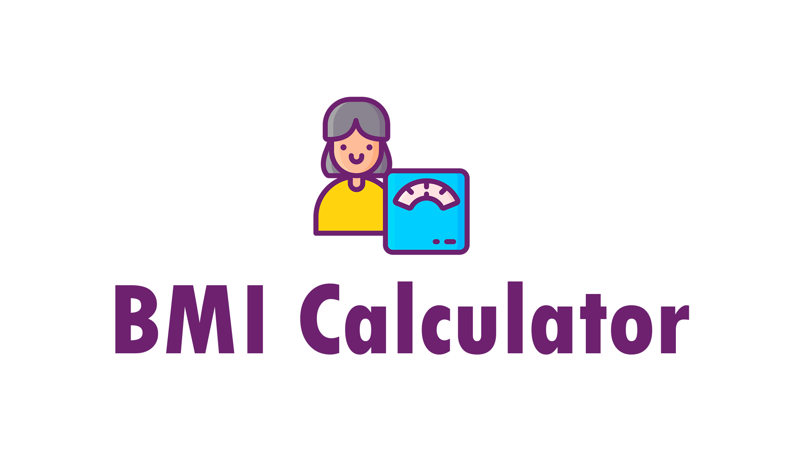
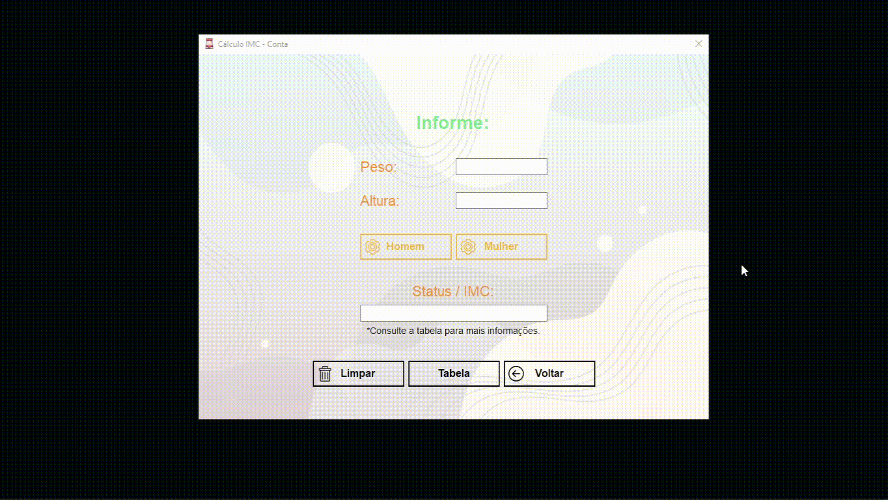

# Bmi-calculator

  

  

## Description  
A program developed with the technology [VB.Net], its objective is to inform the status of your current BMI. With a nice layout, you don't need an internet connection to work.

This program was developed at a didactic level, the goal is to have 3 screens an image: Introduction, calculation and a BMI table.

## Download
https://github.com/Jolonte/bmi-calculator/releases/tag/bmi
